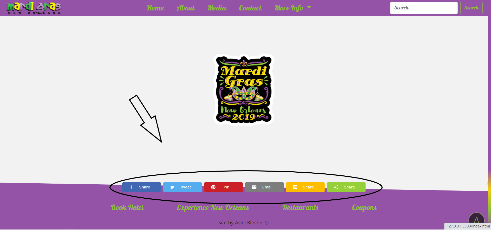

# Mardi Gras

## Tech

* [HTML]() - (HyperText Markup Language) the World Wide Web's core markup language.
* [CSS]() - (Cascading Style Sheets) is the code that styles web content.
* [SASS]() - (Syntactically Awesome Style Sheets), It allows you to use variables, nested rules, mixins, functions, and more, all with a fully CSS-compatible.
* [Bootstrap]() - Design and customize responsive mobile-first sites.
* [JavaScript]() - Scripting language used to create and control dynamic website content.

## Web Flow And Features

## Main page.

### At the main page you can google search at the search line, you have timer till the event and you have replace picture in the back.

### When you scroll down you have clickable cards that open a new tab to the sponsor web page and also back to top button.

### When you scroll more at the end of page you can share on social network on few platforms.

## About page.

### At the top of the page you have header that made of JS function that replace the color any letter and random adds in both sides.

### At the botoom of the page you have two buttons that connect you to faqs or trivia.

### At the media page you can watch picture or video from the event using fancybox.

### At the contact page you have simulation of sending form to the server with fully client manual validation and if valid empty the form like as been send.

### At faq page you can watch mardi-gras faqs with an manual accordion.

## Trivia page.

### At trivia page you have quiz with 10 questions.

### in the end of the page you can press check to get your results, watch your score, where you have wrong answer and by pressing the try again button your its empty your page and let you try again.

## Activated 

1. Download the file.

2. Get to index.html page. 

3. Right click press open in live server (if you don't have this ex [click here](https://marketplace.visualstudio.com/items?itemName=ritwickdey.LiveServer) )

4. Enjoy!

## Free Experience 

> "You can enjoy free access to **Pet's Blog** 
> with no download in [Click To Open](http://pets-blog.rf.gd) ."

